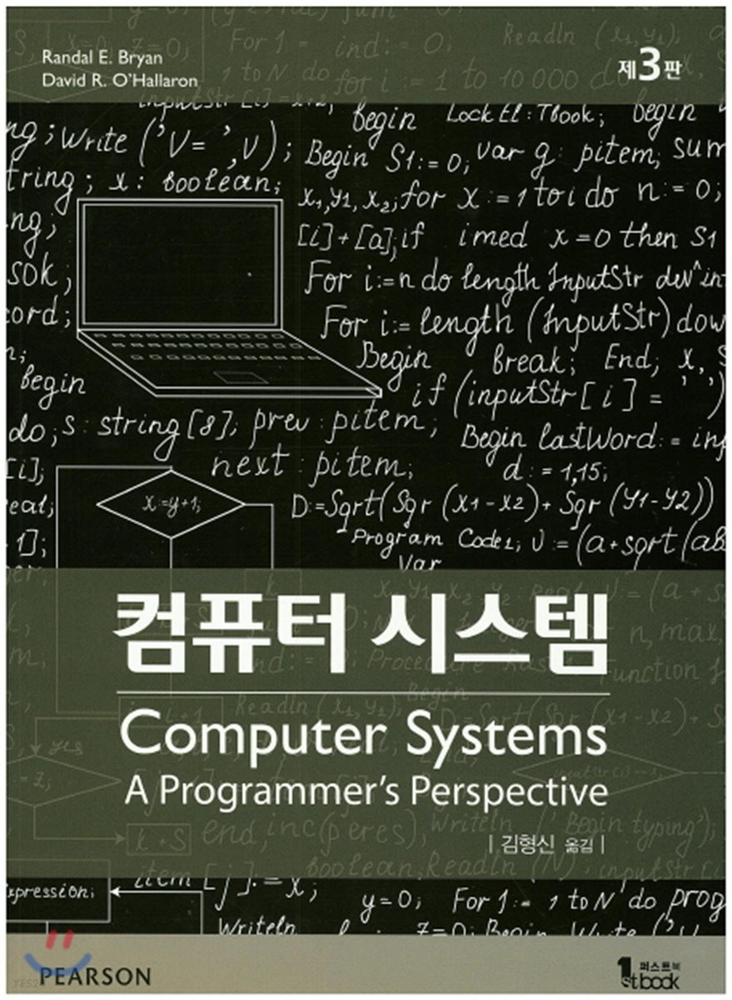

# CSAPP-3e

The lab of Computer Systems: A Programmer's Perspective

The original lab files are downloaded from the [official site](http://csapp.cs.cmu.edu/).

1. Data Lab
2. Bomb Lab
3. Attack Lab
4. Buffer Lab
5. Architecture Lab
6. Cache Lab
7. Performance Lab
8. Shell Lab
9. Malloc Lab
10. Proxy Lab

- [lecture](http://www.cs.cmu.edu/afs/cs/academic/class/15213-f16/www/schedule.html)
- [youtube](https://www.youtube.com/watch?v=4CpHpFu_KYM&list=PLbY-cFJNzq7z_tQGq-rxtq_n2QQDf5vnM)
- [blog ref](https://it-eldorado.tistory.com/32)
